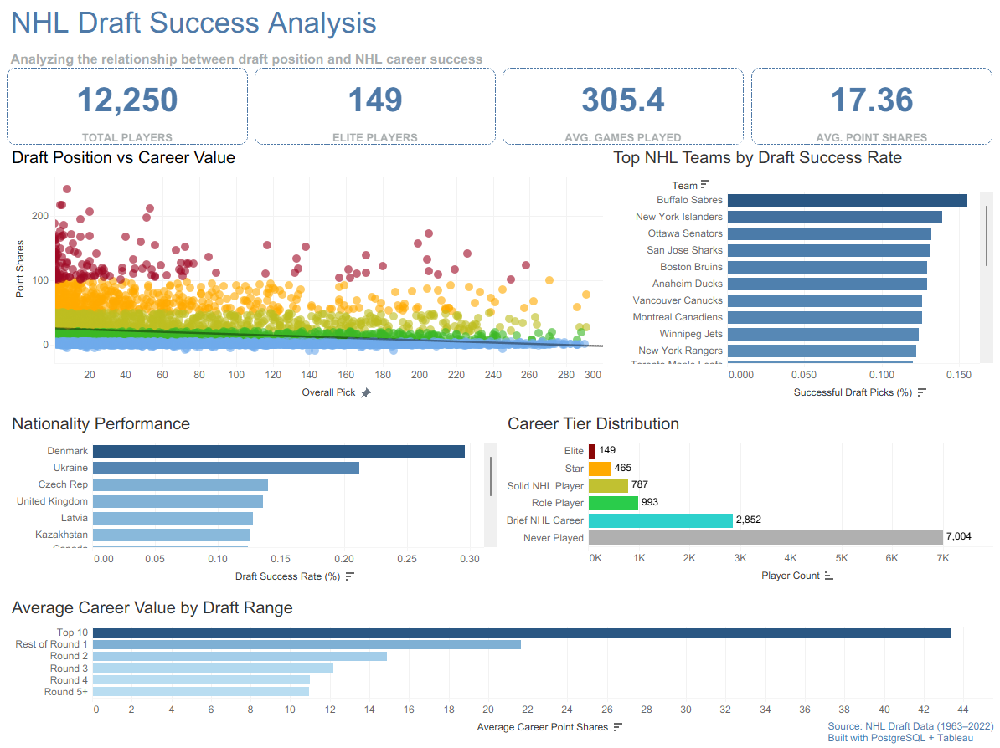
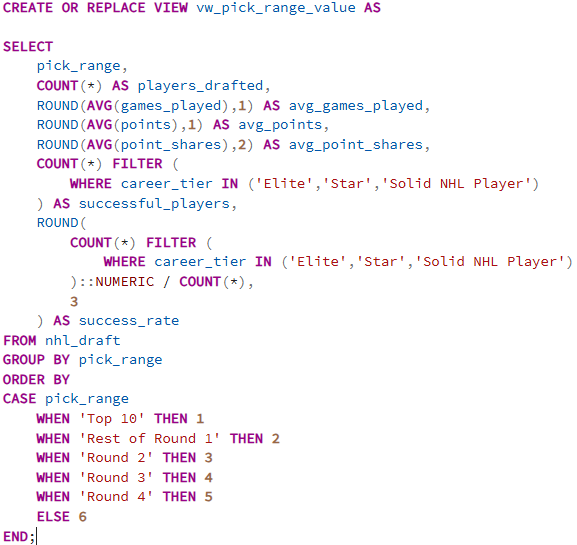
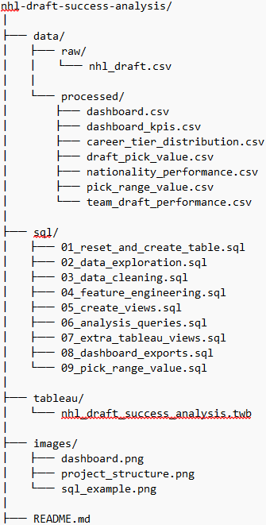

# NHL Draft Analysis Dashboard

## Overview

Not every first-round pick makes it, and some of the best NHL players were taken in the fourth round or later. I wanted to see if the data actually backed that up, and what other patterns show up when you look at decades of draft history all at once.

This project uses SQL and Python to clean and prep the data, then brings it into Tableau as an interactive dashboard you can filter by draft year, country, position, and round.

---

## The Questions I Looked At

**Does draft position actually matter?**
Pretty much yes — earlier picks tend to play more games and put up more points over their careers. But it's not a clean line. There are first-rounders who flame out and sixth-rounders who play 1,000 games. That's what makes the draft interesting.

**Which rounds produce the most value?**
The first round is the most reliable, but every round has produced legit NHL players. The drop-off is real, but it's not like rounds 4-7 are a wasteland either.

**Where do most NHL players come from?**
Canada and the US make up the biggest share, but Sweden, Finland, Russia, and Czechia all show up consistently. Hockey talent is pretty concentrated geographically, but it's not exclusively North American.

**Does position matter for predicting success?**
Forwards get drafted the most and make up most of the career production numbers. Goalies are the trickiest to evaluate — they develop later and the sample sizes get weird. I kept that in mind when looking at success rates by position.

---

## What I Actually Did

The raw data needed a lot of cleanup before it was usable — inconsistent country names, missing values, data types that were wrong, and draft records that didn't match up cleanly with career stats. I used SQL and Python (pandas) to sort all of that out before touching Tableau.

From there I built the dashboard with filters for draft year, nationality, position, and round, plus KPI cards showing overall draft numbers and career averages.

---

## What I Found

The biggest thing that stood out: every single draft class has a huge chunk of players who never really stick in the NHL. That's something everyone in hockey knows, but seeing it laid out across every year in the data makes it more concrete. It's not a fluke — it's just how the draft works.

The country breakdown was also interesting. Canada dominates the raw numbers, but when you look at success rates by country the gap narrows a bit. Some of the European nations punch above their weight relative to how many picks they produce.

---

## Dashboard Screenshots

### Main Dashboard

### Example SQL Screenshot

### Project Structure

---

## Tools Used

SQL, PostgreSQL, Python (pandas), Tableau, GitHub

---

## Why I Built This

I'm learning data analytics and wanted a project that used SQL, Python, and Tableau together on something I actually find interesting. Sports data is messy in realistic ways, so it was good practice for cleaning and prepping data before jumping into visualization. It also pushed me to think about what question I was actually trying to answer instead of just making charts.
